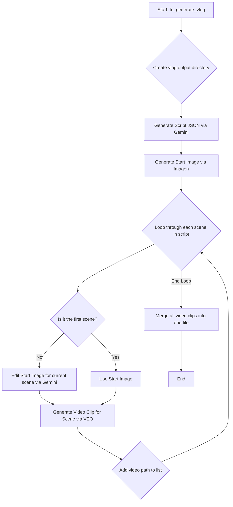

# AI-Powered Video Generation with Google VEO and Gemini

This project contains a Python script that automates the creation of multi-scene videos from a single high-level idea. It leverages a suite of Google's powerful generative AI models, including VEO for video generation, Imagen for image creation, and Gemini for scriptwriting and scene orchestration.

The core of the script is its ability to generate a detailed "screenplay" using structured Pydantic models, ensuring character and scene consistency across multiple video clips, which are then merged into a final, coherent video.

## Features

- **Idea to Video**: Generates a complete, multi-scene video from a simple text prompt (e.g., "A realistic energy drink commercial for athletes.").
- **Structured Scene Generation**: Uses the Gemini model with a detailed Pydantic schema to create a structured script, defining characters, scenes, camera shots, and actions.
- **Character Consistency**: Generates a base image for a character and then uses image editing to adapt the character for subsequent scenes, maintaining visual consistency.
- **Multi-Modal AI**: Integrates several Google Cloud AI models:
  - **Gemini 2.5 Flash**: For generating the structured video script.
  - **Imagen 3.0**: For creating the initial character/scene image.
  - **Gemini 2.0 Flash (Image Generation)**: For editing images to fit new scene descriptions.
  - **VEO 3.0**: For generating video clips from text prompts and images.
- **Automated Video Assembly**: Uses `moviepy` to automatically concatenate the generated video clips into a single final video file.

## Execution Flow

The following flowchart illustrates the end-to-end process of generating a video from a single idea.



## Usage

You can run the script directly from the command line. The main execution block at the end of the file (`if __name__ == "__main__":`) contains a list of ideas to generate.

**Modify the `ideas` list** in `veo3_vid_gen.py` to define the video(s) you want to create. Each entry is a tuple containing the `idea` (a string) and the `number_of_scenes` (an integer).

    ```python
    # c:\Test\veo-character-consistency\veo3_vid_gen.py

    if __name__ == "__main__":
        ideas = [
            (
                "A realistic energy drink commercial for athletes.",
                3,
            ),
            (
                "A stormtrooper being a confused tourist in central London complaining about the weather.",
                4,
            ),
        ]

        for idea, number_of_scenes in ideas:
            try:
                fn_generate_vlog(
                    idea=idea,
                    number_of_scenes=number_of_scenes,
                )
            except Exception as e:
                print(f"An error occurred: {e}. Rerunning...")
                fn_generate_vlog(
                    idea=idea,
                    number_of_scenes=number_of_scenes,
                )
    ```

The script will start the generation process, logging its progress to the console.

## Output Structure

For each idea, the script creates a unique subdirectory inside the `videos/` directory. The subdirectory name is derived from the idea prompt. Inside this folder, you will find:

-   `script.json`: The complete JSON script generated by Gemini.
-   `start_image.png`: The initial image generated by Imagen.
-   `scene_N_image.png`: Edited images for each subsequent scene.
-   `video_N.mp4`: Individual video clips for each scene.
-   `vlog.mp4`: The final, merged video.

Example structure:
```
videos/
└── a-realistic-energy-drink-commerci/
    ├── script.json
    ├── start_image.png
    ├── scene_1_image.png
    ├── scene_2_image.png
    ├── video_0.mp4
    ├── video_1.mp4
    ├── video_2.mp4
    └── vlog.mp4
```
